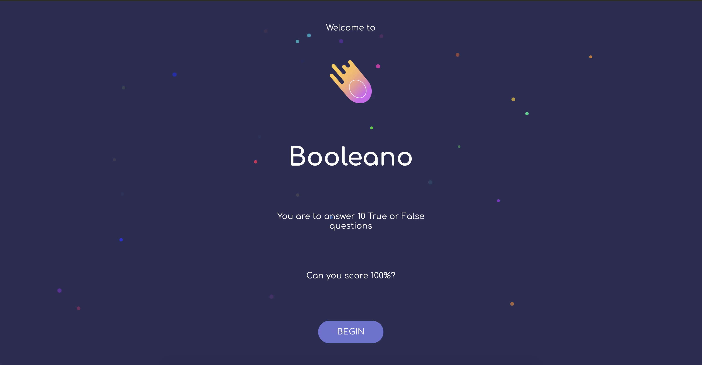

# Booleano


&nbsp;

This project was bootstrapped with [Create React App](https://github.com/facebook/create-react-app).

At its core it uses :
- [React query](https://react-query.tanstack.com/) for Data fetching.
- React context for state management.
- [Emotion](https://emotion.sh/) for writing styles.
- [Jest](https://jestjs.io/) and [React testing library](https://testing-library.com/docs/react-testing-library/intro) for testing.


&nbsp;

### Run the app
```
yarn
yarn start
```
or if you use **npm**
```
npm i
npm start
```

Runs the app in the development mode.\
Open [http://localhost:3000](http://localhost:3000) to view it in the browser. 

&nbsp;

### Run the tests
```
yarn test
```

Launches the test runner in the interactive watch mode.\
See the section about [running tests](https://facebook.github.io/create-react-app/docs/running-tests) for more information.

The tests are in the `test` folders, collocated with the page or component being tested.

&nbsp;

### Feel like deploying?

```
yarn build
```

Builds the app for production to the `build` folder.\
It correctly bundles React in production mode and optimizes the build for the best performance.

See the section about [deployment](https://facebook.github.io/create-react-app/docs/deployment) for more information.

&nbsp;

### Learn More

You can learn more in the [Create React App documentation](https://facebook.github.io/create-react-app/docs/getting-started).
